# CIR

Link to Backend:

* Repository: [https://github.com/IanTeo/cs3219-Project](https://github.com/IanTeo/cs3219-Project)
* Link: [http://128.199.249.171/](http://128.199.249.171/)

Link to Frontend:

* Repository: [https://github.com/AngShiYa/cs3219-d3](https://github.com/AngShiYa/cs3219-d3)
* Link: [http://cir-group-10.herokuapp.com/](http://cir-group-10.herokuapp.com/)


## 1. Introduction

**Ang Shi Ya (A0138601M)**<br>
Features Implemented:

* Frontend `Website` Project Structure
* UI/UX
* Responsive UI
* Visualization of **4.1 Time Series**
* Visualization of **4.2 Composition**
* Visualization of **4.3 Comparison**
* Visualization of **4.4 Relationship**

**Ian Teo (A0139930B)**<br>
Features Implemented:

* Backend `REST Server` Project Structure
* JSON data parsing
* Top Command (Data for **4.3 Comparison**)
* Web Command (Data for **4.4 Relationship**)
* Word Command (Data for **4.5 Text Analysis**)
* All related Tests for Backend
* Visualization of **4.5 Text Analysis**
* Server set up for Frontend and Backend
* `FindBugs`, `JaCoCo` and `Travis CI` set up

**Yong Zhi Yuan (A0139655U)**<br>
Features Implemented:

* Trend Command (Data for **4.1 Time Series**, **4.2 Composition**)
* Utility for `Logic`
* Filter for `Logic`
* `Model`
* All related Tests for Backend

Bonus features:

* Flexible Commands
* Responsive UI
* Beautiful and Intuitive UI
* Maintainable
* Extendable
* Cloud Integration

CIR is a website for the NLP Research Lab to visualize conference publication data using various queries. The `Website` focus is solely on the visualization, and an additional `REST Server` is used to parse the data into a suitable format for visualization by the website.

## 2. Requirement Specification

### 2.1 Functional Requirements

As a User, I can.. | so that I can..
----|----|
visualize trends over a time period with specific venues/authors/papers | compare the trends of the data that I am interested in
compare specific venues/authors/papers over a specific year | compare the trends of the data that I am interested in
view the top few venues/authors/papers | see what venues/authors/papers are of interest
filter information that I am not interested in |  remove confounders in the data
see more than 3 visualizations of the data | see the data from different angles

### 2.2 Non-Functional Requirements

* Should work on any platform/browser with internet connection
* Should come with automated tests that cover at least 90% of code base
* Should be easy to deploy (less than 3 steps to deploy Frontend/Backend application)

## 3. Design and Implementation

### 3.1 Architecture

We use a 3 tier architecture, which comprises of the following parts:

* `REST Server` (Java)
* `Website` (Javascript, d3.js, node.js)
* `Resource` (JSON file storage).

The `REST Server` preprocesses the `Resource`, which is the first 200,000 lines of data from  [http://labs.semanticscholar.org/corpus/](http://labs.semanticscholar.org/corpus/) and provides a service which answers queries with a JSON file suitable for visual representation. The `Website` queries the `REST Server` and visualizes the data it recieves.

<p align="center">
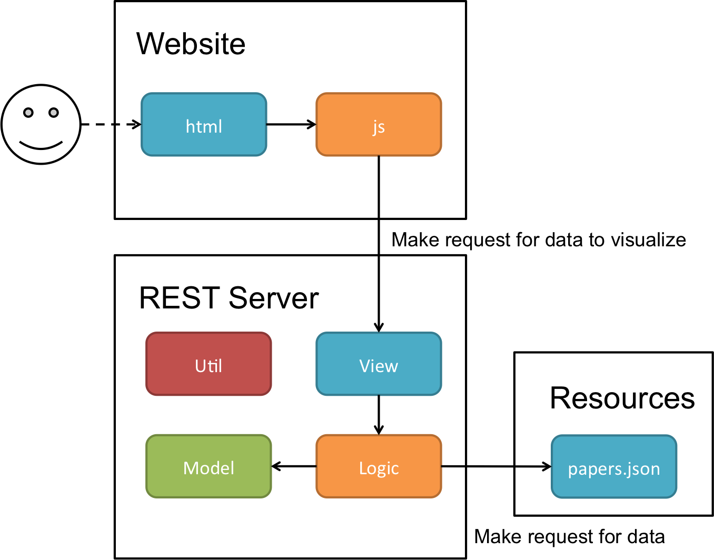<br>

<em>Figure 1: Architecture Overview Diagram</em>
</p>

This makes each of our layers independent, allowing us to work simultaneously on different parts of the project at the same time, with minimal affect to the other parts of the system. The independence also makes unit testing each component easier as they are less coupled. Lastly, this architecture provides ease of maintenance, as changes in 1 layer will rarely affect other layers.

#### Logic

We decided to apply the `Command Pattern` as we have multiple Commands, and the executor of these Commands to not need to know anything about the command that it is executing.

<p align="center">
<br>

<em>Figure 2: Command Pattern Diagram</em>
</p>

This also follows the `Open-Closed Principle` as new Commands can be added without having to modify the existing Commands.

We created a `ParseException` to signify that there is an error with the parsing of the given data. `XCommandParser` will throw `ParseException` whenever compulsory fields are missing, or when any of the fields fail input validation. The erroneous fields will be captured as part of the error message, which allows the user to know which field to correct.

#### Trend Command

Our customer Simon mentioned that the trend he is looking for is one-dimensional, that is if the `year` is fixed, then the viewpoints for inspection is `conferences` (i.e. The comparisons made are between `conferences` for the same year). Conversely, if the `conference` is fixed, then the viewpoints for inspection is `years`. However, we thought that these graph plots are very limiting and do not convey much information. As such, we have decided to do a two-dimensional visualisation, that is both `years` and `conferences` can have varying values. This allows users to perform more meaningful comparisons, namely comparing different `conferences` across different `years`. 

Also, we have included a filtering functionality to allow users to filter data. What Simon required from us is to support mono-filtering (e.g. Only the term `Authors` will be filtered in the query: "Number of Papers written by Authors x, y, z in 2001"), however we have implemented the functionality to perform multiple filterings. As such, we can accept queries such as: "Number of Papers written by Authors x, y, z where Venue is ICSE or ACXiV". 

### 3.2 Typical Flow of Application

<p align="center">
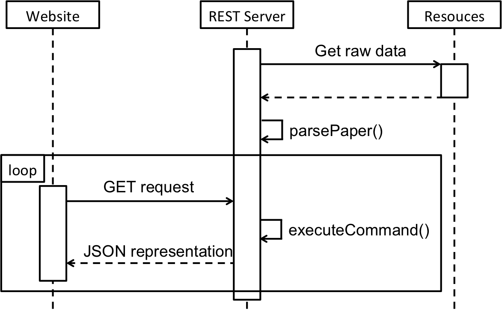<br>

<em>Figure 3: Sequence Diagram of a Typical Flow in the Application</em>
</p>


At the start, `REST Server` has to prepare the data, which it requests from `Resources`. After parsing the data, the server will be open to HTTP GET requests.

User will query `Website`, which sends a HTTP GET request with the appropriate parameters to `REST Server`, which handles the request and passes back a suitable JSON representation which best suits the user's query, which `Website` will use to generate a suitable chart.

### 3.3 REST Server Architecture

<p align="center">
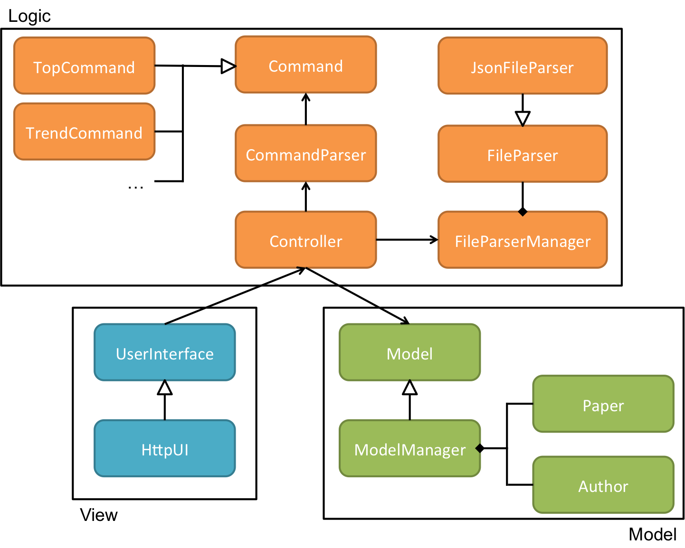<br>

<em>Figure 4: Architecture of REST Server</em>
</p>

`REST Server` is mainly comprised of 3 components, `Model`, `View` and `Logic`. `Model` is a data structure to store and represent the data. `View` is the way to communicate with external channels, in this case using HTTP, but can easily be changed for another type of view. `Logic` is where the main processing of the data happens. **Command Pattern** is used to encapsulate the different commands, making it easier to extend, maintain and add new commands. `Logic` also contains other packages, such as **Filter**, **JsonConverter** and **MapUtility** that provide commonly used features to manupilate data for different Commands.

### 3.4 Typical flow of Logic Component

<p align="center">
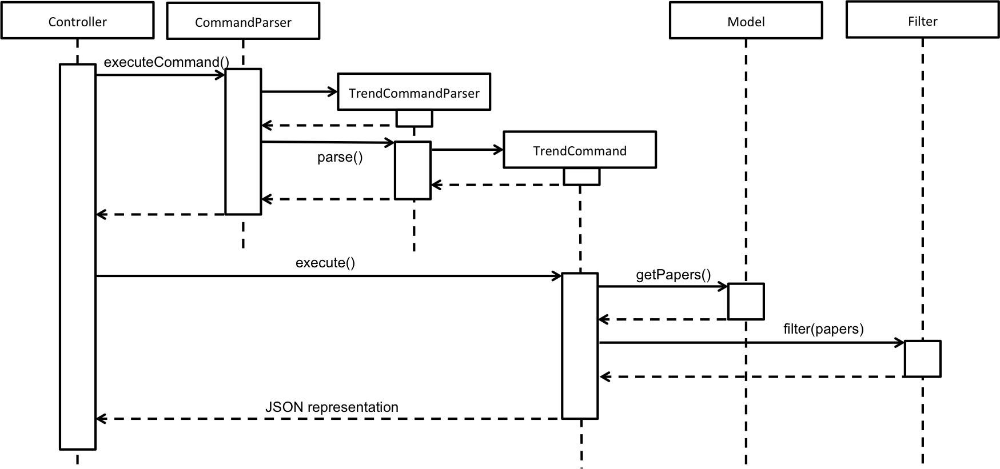<br>

<em>Figure 5: Sequence Diagram of Trend Command</em>
</p>

When `Controller` recieves a request, it passes the request to `CommandParser` to choose the appropriate command. In this case, it chose trend command, and activates `TrendCommandParser` to parse the data and create a new `TrendCommand` object. Controller the executes the command, which in this case, gets the data from `Model`, and uses `Filter` to remove unwanted data. Once `TrendCommand` is done executing the command, it returns 

### 3.5 Implementation of RESTful Service

We chose not to use `Spring`, even though it provides an easy way to create a RESTful service on Java, for 2 reasons:


1. The size of the dependencies was bigger than the project. We only needed the basic RESTful functionalities, which would bloat our project with many files that we do not need.
2. Developers do not need to learn an additional framework to maintain/improve the current code base.

Instead, we opted to use `HttpServer`, which was included in `Java 6`.

`HttpServer` creates a listener on the specified port, based on the system's environment variable. If not port is specified, it defaults to port 8000. A single listener is created that acts as a **Front Controller** for the application. The listener waits for HTTP requests, parses the request and sends it to `Logic` to execute the request. Front Controller Pattern was chosen to avoid code duplication, as the parsing is similar for all requests.

### 3.6 Continuous Integration

We use `JUnit` tests to perform automated tests application with `Gradle`, together with `JaCoCo` to generate the test coverage report. In addition, we use the static analysis tool `FindBugs`, to help maintain a consistent level of code quality, reduce complexity and find common bugs and errors.

<p align="center">
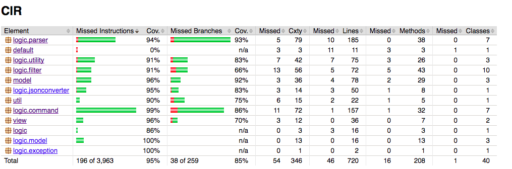<br>

<em>Figure 6: Latest Test Code Coverage Results</em>
</p>

These tools help to ensure that the application is always in a state that is ready to be deployed at any time. All these tools are run automatically by `Travis` whenever new code is pushed, except for `JaCoCo`, which cannot be run for free on a private repository. We added `JaCoCo` on the deadline of the assignment, when we made the repository public.

### 3.7 Error Handling

We added a Parser for each Command, seperate the parsing and validation logic from the actual execution logic. This allowed us to make robust error handling mechanisms without cluttering the execution logic of each command.

Errors are detected by the individual parsers and sent back as an `InvalidCommand`, where it sends a JSON representation of the error to `View`. Once `Website` recieves the error message, the user will be prompted with an appropriate error message, guiding the user to fix the problem area.

In addition, `Website` provides intuitive inputs like dropdown list for predefined categories, which minimizes erroneous input.

## 4. Visualizations

Visualization queries are performed through form based inputs, where the user either types the input or selects from a dropdown list. There are 2 types of dropdown lists:

* Category
  * **total**: Group **all** results in a single group
  * **paper**: Group the result by **paper titles**
  * **author**: Group the result by **author names**
  * **venue**: Group the result by **venues**
* Measure
  * **paper**: Count the sum of **papers** in the group
  * **author**: Count the sum of **authors** in the group
  * **venue**: Count the sum of **venues** in the group
  * **incitation**: Count the sum of **in-citations** (papers that cite this paper) in the group
  * **outcitation**: Count the sum of **out-citations** (papers that this paper cites) in the group

There are also 3 filters that can be applied to all trend based queries. The filters are:

* **Paper**: Only papers with titles specified here will be considered for the query
* **author**: Only papers with authors specified here will be considered for the query
* **venue**: Only papers with venues specified here will be considered for the query

The filters are optional, except for **4.1 Time Series** and **4.2 Composition**, where the filter for the selected category must be specified. This is because there can be a huge amount of data sent when the filter is not specified, which is too much for the small bandwidth of our free servers.

### 4.1 Time Series

<p align="center">
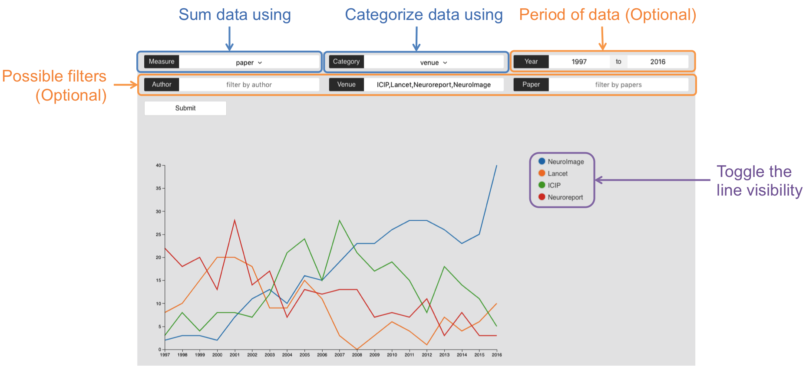<br>

<em>Figure 7: Time Series Visualization</em>
</p>

This chart shows the **transition over time** for any specified venues/authors/papers. Here, we count the **number of papers** per year, group by **venues (ICIP, Lancet, Neuroreport, NeuroImage)** over the years **1997 to 2016**.

<p align="center">
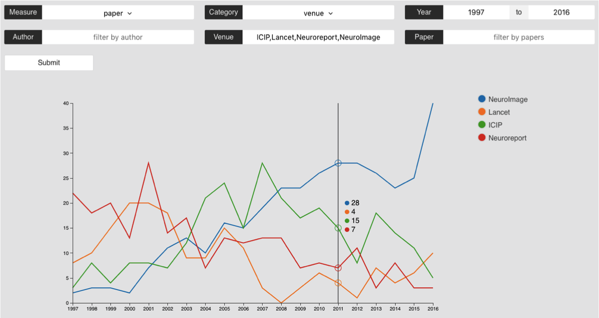<br>

<em>Figure 8: Mouse Over Lines</em>
</p>

To get a clearer view of the number of papers for each venue for a particular year, we can mouse over the chart to see the details.

<p align="center">
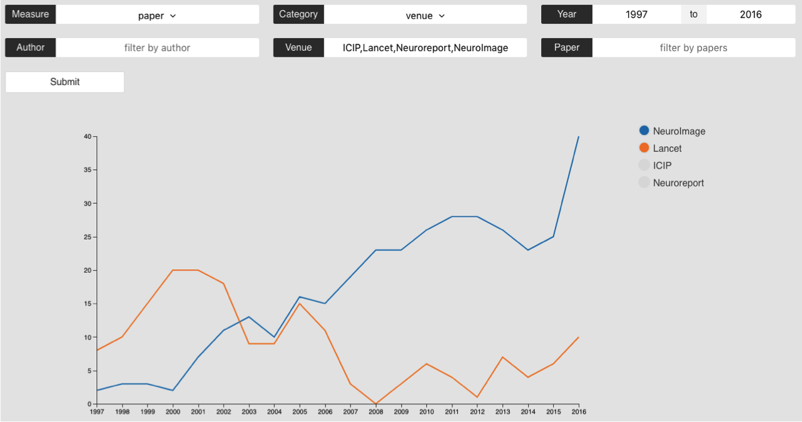<br>

<em>Figure 9: Toggling Visibility of Lines</em>
</p>

The legend can be clicked to toggle visibility of the line with the clicked color, so that a better comparison can be made for the data of interest.

### 4.2 Composition

<p align="center">
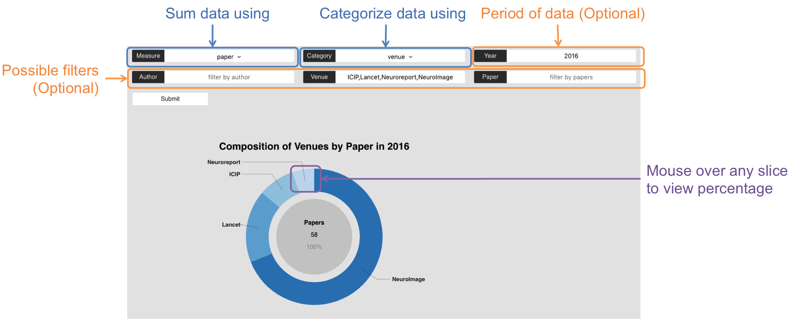<br>

<em>Figure 10: Composition Visualization</em>
</p>

This chart shows the **contemporary comparison** for any specified venues/authors/papers. Previously, in Figure 5, there was a spike in number of papers for the venue **NeuroImage**. We can view that point of interest in more detail here. Here, we have the same fields, except we fix the year to **2016**.

<p align="center">
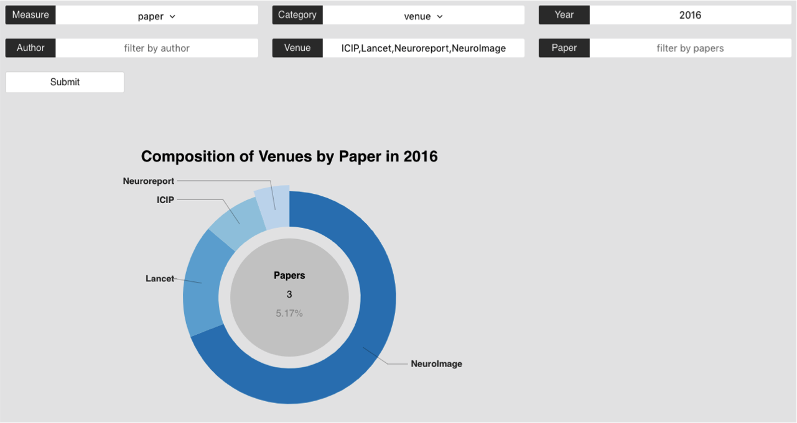<br>

<em>Figure 11: Mouse Over on a Slice</em>
</p>

You can **mouse over** any of the slices in the pie chart to see the exact count and percentage of the slice.

<p align="center">
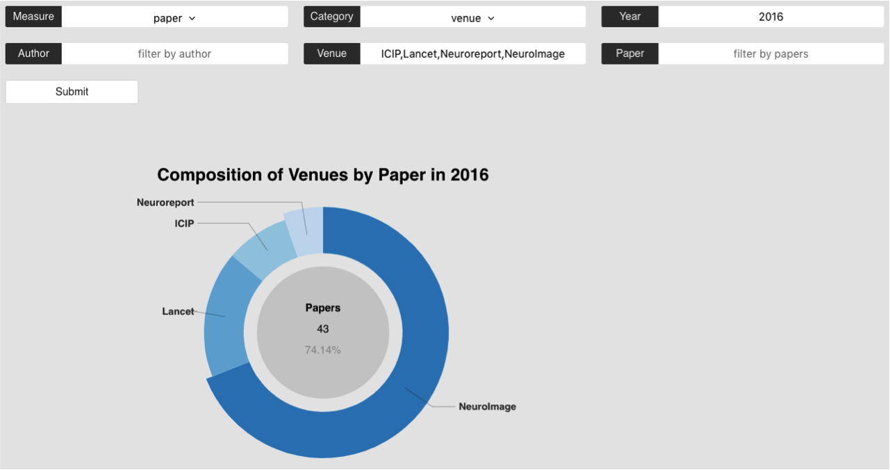<br>

<em>Figure 12: Mouse Click on Multiple Slices</em>
</p>

You can also click on each slice if you want to see the total count of multiple slices.

### 4.3 Comparison

<p align="center">
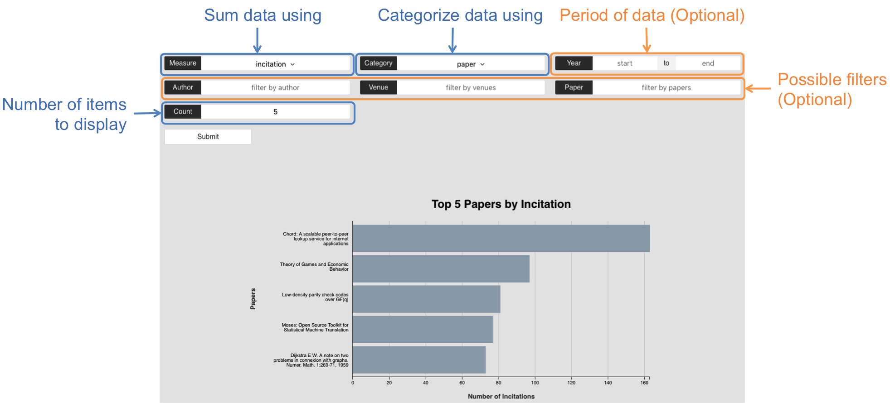<br>

<em>Figure 13: Comparison Visualization</em>
</p>

This chart shows the **Top N X of Y** for any specified venues/authors/papers. Here, we want to see the top 5 papers based on in-citation.

### 4.4 Relationship

<p align="center">
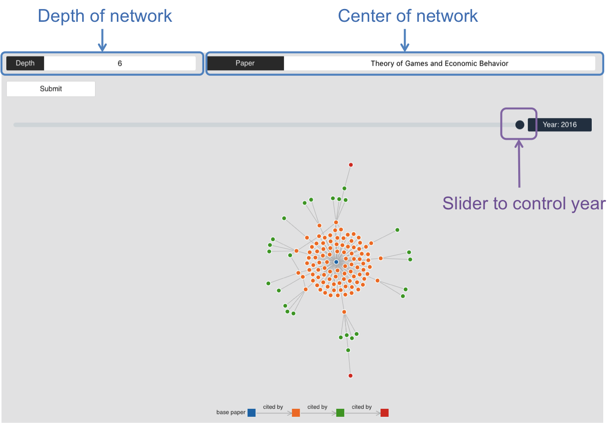<br>

<em>Figure 14: Relationship Visualization</em>
</p>

This chart shows the citation relationship between papers. Previously, in Figure 11, we saw the top few papers based on in-citation. We can view one of the points of interest there using this query. Here, we are viewing the relationship network for the paper **Theory of Games and Economic Behavior**

<p align="center">
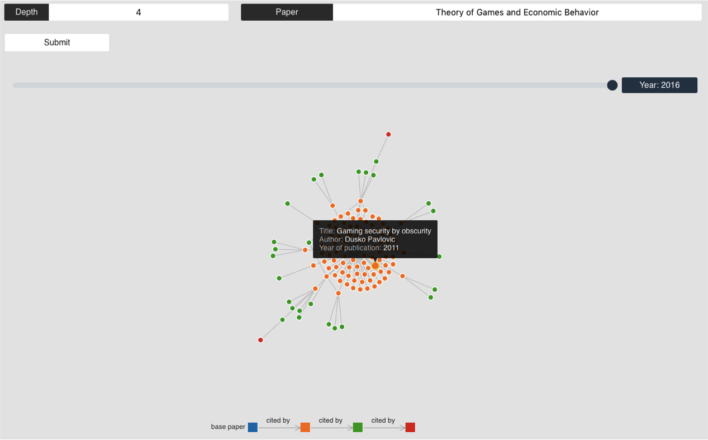<br>

<em>Figure 15: Mouse Over Nodes</em>
</p>

We can mouse over any node to see more details about each individual paper in the relationship network

<p align="center">
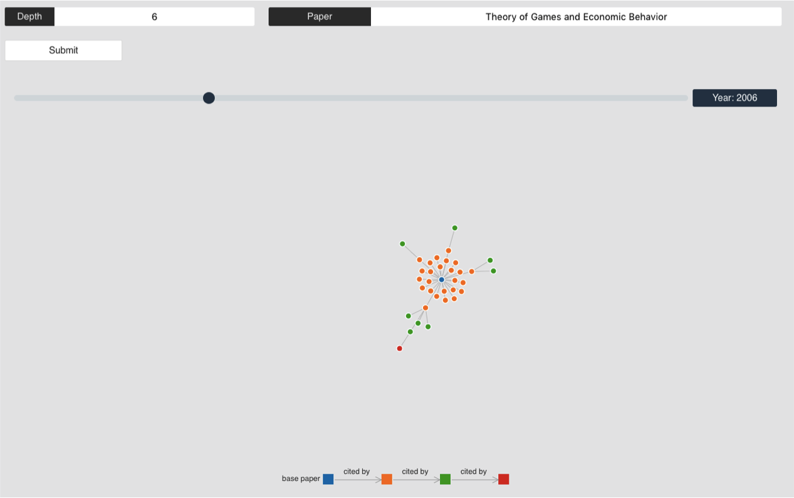<br>

<em>Figure 16: Moving the Year Slider</em>
</p>

The year slider can be changed to view the cumulative relationship network up to the selected year.

### 4.5 Text Analysis

<p align="center">
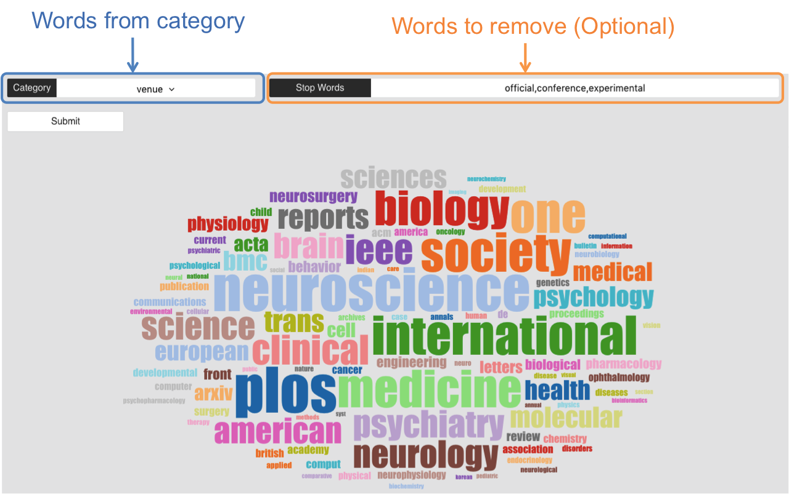<br>

<em>Figure 17: Text Analysis Visualization</em>
</p>

This chart shows a simple text analysis of the specified category. Here, we can find out topics of interest for each of the different categories. Although Common stop words are already filtered by the `REST Server`, additional stop words can be added if the user feels the word found is not useful to the visualization. 

## 5. Additional Information

### 5.1 Server
Initially, we intended to use `Heroku` to host both the website and the RESTful service, as it was free. However for Java, `Heroku` only catered towards deployment using `Spring` and `Ratpack`, and it was difficult to get the RESTful service using the built in `HttpServer` to work. In addition, the data file (500mb) was too big to be uploaded onto the **free** version.


#### 5.1.1 RESTful Service
Eventually, we decided to use `DigitalOcean` to host the server. The steps to prepare the server to deploy the RESTful service are as follows:

1. ssh into the server
2. Create a `fat JAR`
3. Upload the data file and `fat JAR` file
4. Create a `service` in `/etc/systemd/system` to run the JAR file.
5. Run the `service`

javaserver.service 

```
[Unit]
Description=Java Server

[Service]
Type=simple
WorkingDirectory=/root
ExecStart/usr/bin/java -jar -Xmx1500m CIR.jar
Environment="PORT-80"

[Install]
WantedBy=multi-user.target
```

For this project, all these steps are automated, and the project can be run by executing `javaserver.sh`, which pulls the changes from github and runs the `service`

javaserver.sh

```
cd ~/cs3219-Project
git checkout master
git pull
./gradlew shadowJar
mv build/libs/CIR.jar ../CIR.jar

systemctl daemon-reload
systemctl stop javaserver.service
systemctl start javaserver.service
systemctl status javaservice.service
```

#### 5.1.2 Website

For the website, `Heroku` provided easy deployment using `node`. We deployed the website following the steps on their online [tutorial](https://devcenter.heroku.com/articles/getting-started-with-nodejs#introduction).
