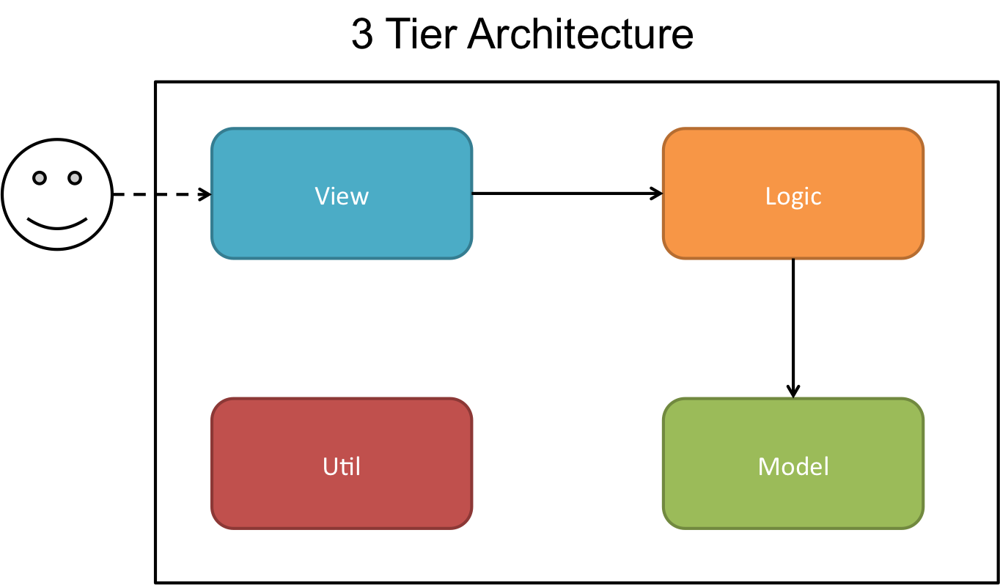

# CIR

## 1. Introduction

Name | Matriculation Number | Feature Implemented
----|----|----|
Ang Shi Ya | A0138601M | **Frontend Project Structure**, **UI/UX**, Visualization of **Time Series** & **Composition** & **Comparison** & **Relationship** Graphs
Ian Teo | A0139930B | **Json Data Parsing**, Visualization of **Text Analysis** Graph, **Server** Set up for Frontend and Backend, **Backend Project Structure**, **Top** Command, **Web** Command, **Word** Command and all related **Tests**
Yong Zhi Yuan | A0139655U | **Trend** Command, **Utility**, **Filters**, **Model** and all related **Tests**

This project comprises of 2 parts, a `RESTful Service` (Java) and `Website` (Javascript). The `RESTful Service` preprocesses the first 200,000 lines of data from  [http://labs.semanticscholar.org/corpus/](http://labs.semanticscholar.org/corpus/) and provides a service which answers queries with a JSON file suitable for visual representation. The `Website` queries the `RESTful Service` and visualizes the data it recieves.

## 2. Requirement Specification

## 3. Design and Implementation

### Architecture

We decided to use a 3 tier architecture, so that we could seperate the **view** (Presentation Layer), **logic** (Application Layer) and **model** (Data Layer) into 3 distinct components.

 

<em>Figure 1: Architecture Overview Diagram</em>

This makes each of our layers independent, allowing us to work simulatanuously on different parts of the project at the same time, with minimal affect to the other parts of the system. The independence also makes unit testing each component easier as they are less coupled. Lastly, this architecture provides ease of maintaince, as changes in 1 layer will rarely affect other layers.

### Typical Flow of Application

 

<em>Figure 1: Sequence Diagram of a typical flow</em>

`View` recieves a request from the user as a HTTP GET request, which it processes and sends a request over to `Logic`. `Logic` then determines the appropriate actions to take, and gets the relevant details from `Model`. After which, `Logic` processes the data into a JSON representation which best suits the user's query, which `View` displays to the user via HTTP.

### Implementation of RESTful Service

We chose not to use `Spring`, even though provides an easy way to create a RESTful service on Java, for 2 reasons:

1. The size of the dependencies was bigger than the project. We only needed the basic RESTful functionalities, which would bloat our project with many files that we do not need.
2. Developers do not need to learn an additional framework to maintain/improve the current code base.

Instead, we opted to use `HttpServer`, which was included in `Java 6`.

## 4. Visualizations

### Time Series

### Composition

### Comparison

### Relationship

### Text Analysis

## 5. Additional Information

### Server
Initially, we intended to use `Heroku` to host both the website and the RESTful service, as it was free. However for Java, `Heroku` only catered towards deployment using `Spring` and `Ratpack`, and it was difficult to get the RESTful service using the built in `HttpServer` to work. In addition, the data file (500mb) was too big to be uploaded onto the **free** version.

#### RESTful Service
Eventually, we decided to use `DigitalOcean` to host the server. The steps to prepare the server to deploy the RESTful service are as follows:

1. ssh into the server
2. Create a `fat JAR`
3. Upload the data file and `fat JAR` file
4. Create a `service` in `/etc/systemd/system` to run the JAR file.
5. Run the `service`

For this project, all these steps are automated, and the project can be run by executing `javaserver.sh`, which pulls the changes from github and runs the `service`

The RESTful service can be used at [128.199.249.171](http://128.199.249.171/)

#### Website

For the website, `Heroku` provided easy deployment using `node`. We deployed the website following the steps on their online [tutorial](https://devcenter.heroku.com/articles/getting-started-with-nodejs#introduction).

The website can be viewed at [cir-group-7.herokuapp.com](http://cir-group-7.herokuapp.com/)